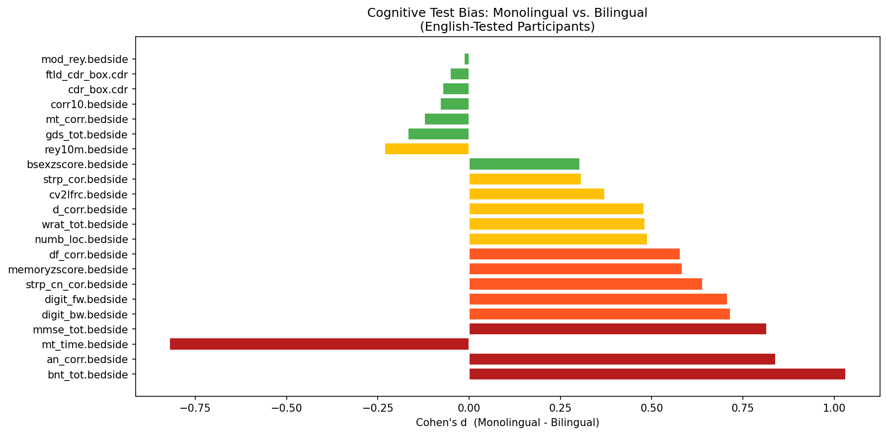
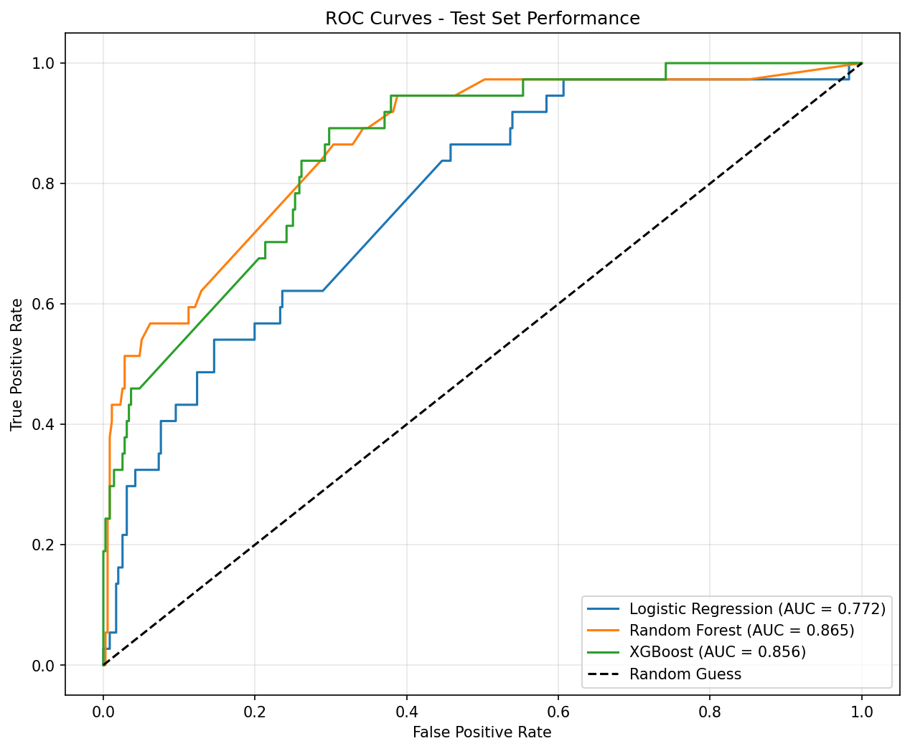
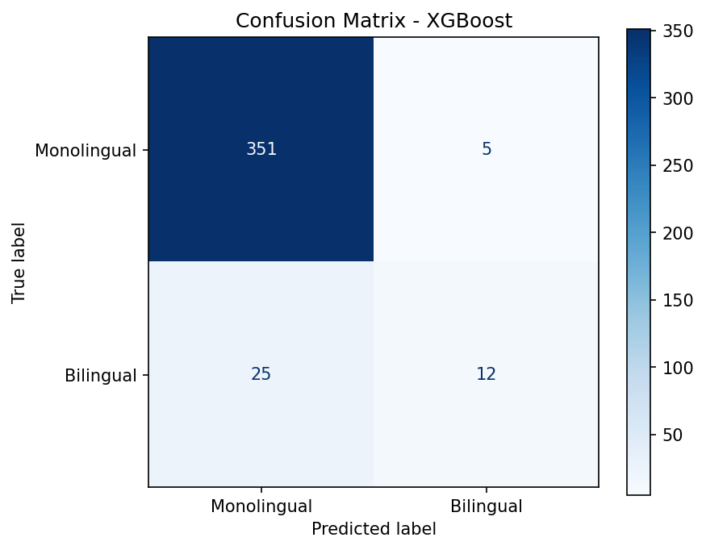
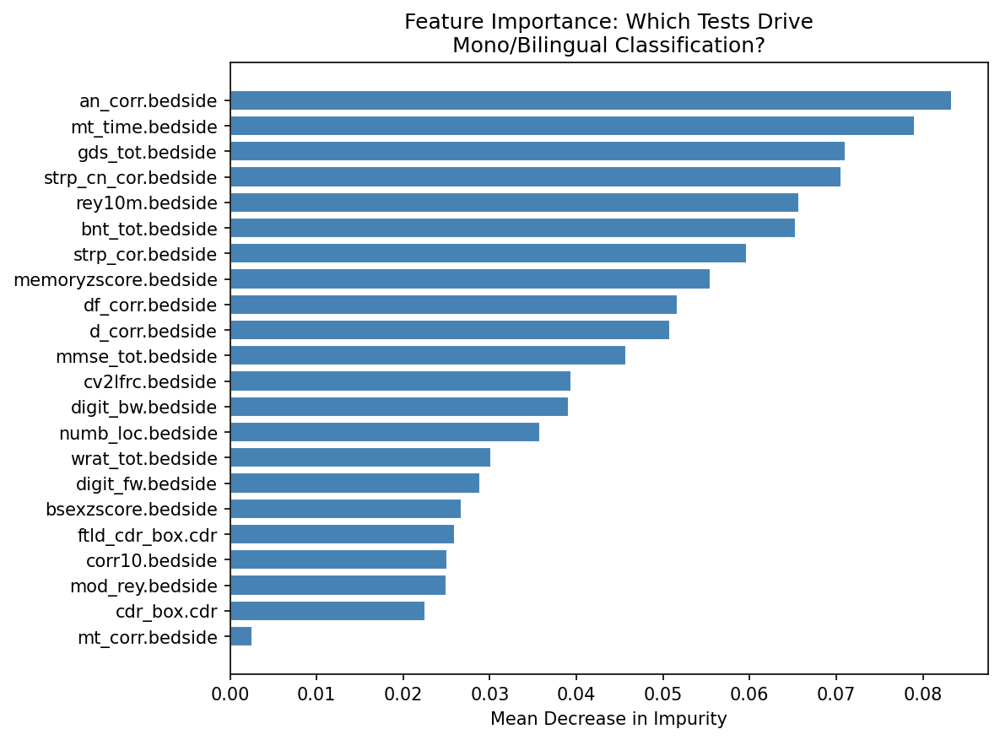
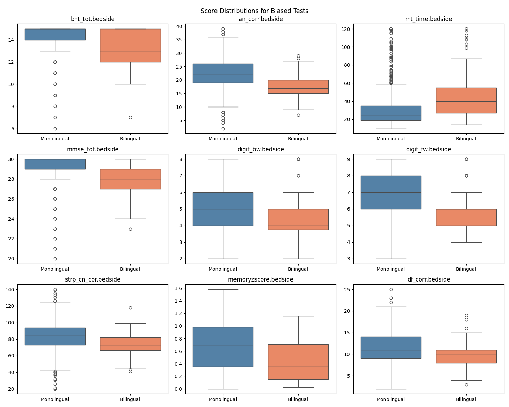

## Overview

Standard neuropsychological tests administered in English may not perform equally across all patients. Bilingual individuals tested in their non-primary language may score differently not because of cognitive differences, but because the tests themselves carry linguistic and cultural bias. In clinical settings, this can lead to misdiagnosis of cognitive impairment in bilingual patients.[1]

This project is an extension of the existing work that I have completed for my Capstone with Dr. de Leon. First, I translated an existing R-based bias analysis into Python using Cohen's d effect sizes to quantify performance differences between monolingual and bilingual English-tested participants across 22 neuropsychological tests. The second part extends the analysis with supervised machine learning. If the bias is systematic, a classifier should be able to predict whether the participant is monolingual or bilingual from test scores alone.

## Research Question

Which cognitive tests show bias between monolinguals and bilinguals and can a machine learning model tell them apart from test scores alone?

## Notebook

```bash
jupyter notebook cognitive_bias_analysis.ipynb
```

## Dataset

| Field | Detail |
|---|---|
| Source | UCSF BRANCH Study (de Leon Lab, Department of Neurology) |
| Participants | 1,964 (1,779 monolingual, 185 bilingual) |
| Input features | 22 neuropsychological test scores: `mmse_tot.bedside`, `corr10.bedside`, `mt_time.bedside`, `mt_corr.bedside`, `df_corr.bedside`, `mod_rey.bedside`, `digit_fw.bedside`, `digit_bw.bedside`, `wrat_tot.bedside`, `d_corr.bedside`, `an_corr.bedside`, `rey10m.bedside`, `bnt_tot.bedside`, `strp_cn_cor.bedside`, `strp_cor.bedside`, `numb_loc.bedside`, `gds_tot.bedside`, `cv2lfrc.bedside`, `memoryzscore.bedside`, `bsexzscore.bedside`, `cdr_box.cdr`, `ftld_cdr_box.cdr` |
| Output | Binary group membership — Monolingual (0) or Bilingual (1) |
| Raw dataset | 5,175 rows × 3,912 columns |
| After English filter | 1,964 rows |
| Train/test split | 1,571 train+val / 393 test |
| Feature matrix | 1,964 × 22 |
| Class distribution | 1,779 monolingual (90.6%) / 185 bilingual (9.4%) |


## How to Run

**1. Install dependencies**
```bash
pip install pandas numpy scipy scikit-learn matplotlib seaborn xgboost
```

**2. Add the dataset**

Place `final_branchsummer2025_dataset_2025-12-02.csv` in the same folder as the notebook. This file is not included in the repository as it contains de-identified patient data from the UCSF de Leon Lab.

**3. Launch the notebook**
```bash
jupyter notebook cognitive_bias_analysis.ipynb
```

Run all cells from top to bottom.


## Results

### Cohen's d Bias Analysis

| Bias Level | Count | Tests |
|---|---|---|
| Large (d ≥ 0.8) | 4 | Boston Naming (1.032), Animal Fluency (0.840), Modified Trails time (-0.821), MMSE (0.815) |
| Medium (0.5 ≤ d < 0.8) | 5 | Digit Span Backward (0.715), Digit Span Forward (0.708), Stroop Color Naming (0.640), Memory Z-Score (0.584), Design Fluency (0.578) |
| Small (0.2 ≤ d < 0.5) | 6 | Number Location (0.488), WRAT (0.481), Digit Cancellation (0.479), CVLT Free Recall (0.371), Stroop Color (0.307), Rey 10-Min Recall (-0.232) |
| Fair (d < 0.2) | 7 | Benson Executive Z-Score (0.303\*), GDS (0.168), Modified Trails Correct (-0.122), 10-Word Correct (-0.079), CDR Box (−0.072), FTLD CDR Box (-0.052), Modified Rey Recall (-0.013) |

In all large-bias cases except Modified Trails time, monolingual participants scored higher. For Trails time, bilinguals took significantly longer. This is consistent with processing speed being affected when tested in a non-primary language.

---

### Classification (AUC)

| Model | CV AUC | Test AUC |
|---|---|---|
| Logistic Regression | 0.716 | 0.772 |
| Random Forest | 0.800 | **0.865** |
| XGBoost | **0.821** | 0.856 |

CV and test AUCs were close across all models, suggesting no overfitting. However, overall accuracy of 91-92% is misleading due to the 10:1 class imbalance. The best model correctly identified only 12 of 37 bilingual participants in the test set.

---

### Feature Importance

Animal Fluency and Modified Trails time were the strongest drivers of classification, followed by Geriatric Depression Scale, Stroop Color Naming, and Modified Rey Recall. These align closely with the tests showing the largest Cohen's d effect sizes. This confirms that the same tests identified as biased are the ones the classifier relies on most.

## Example Output

Running the notebook produces the following:

| Output | Description |
|---|---|
| Bias analysis table | Cohen's d effect sizes and bias classification for all 22 tests, saved as `bias_analysis_cohens_d.csv` |
| Score distribution boxplots | Group comparisons for all tests classified as medium or large bias |
| Cohen's d chart | Horizontal bar chart of effect sizes colored by bias level |
| Cross-validation results | AUC per fold across all three models with summary table and boxplot |
| ROC curves | Test set performance for all three models on a single plot |
| Confusion matrix | Best model predictions on the held-out test set |
| Feature importance | Which cognitive tests most strongly drive the classification |
| Model comparison table | CV AUC vs test AUC for each model, saved as `model_comparison_results.csv` |







## Decisions & Trade-offs

| Decision | Rationale |
|---|---|
| `MIN_N = 50` | Needed enough observations per variable for stable effect size estimates. Variables with fewer than 50 total observations were excluded. |
| `SimpleImputer` (median) | No participant had complete data across all 22 tests — dropping rows with any missing value left zero samples. Median imputation was the practical solution. |
| Stratified K-Fold | With a 10:1 class imbalance, regular K-Fold would risk putting very few bilingual participants in some folds. Stratifying preserves the class ratio across all 5 folds. |
| SMOTE not applied | Class imbalance was acknowledged but not addressed in this submission. Applying SMOTE would likely improve bilingual recall, which is the weakest part of the current results. |
| Cohen's d analysis | Ported from existing R code written for the capstone with Dr. de Leon. |

## Citations

1. Lehtonen, M., Soveri, A., Laine, A., Järvenpää, J., de Bruin, A., & Antfolk, J. (2018). Is bilingualism associated with enhanced executive functioning in adults? A meta-analytic review. *Psychological Bulletin, 144*(4), 394–425. https://doi.org/10.1037/bul0000142

2. Malvin, D. (2025). *Original bias analysis*. de Leon Lab, UCSF Department of Neurology.
